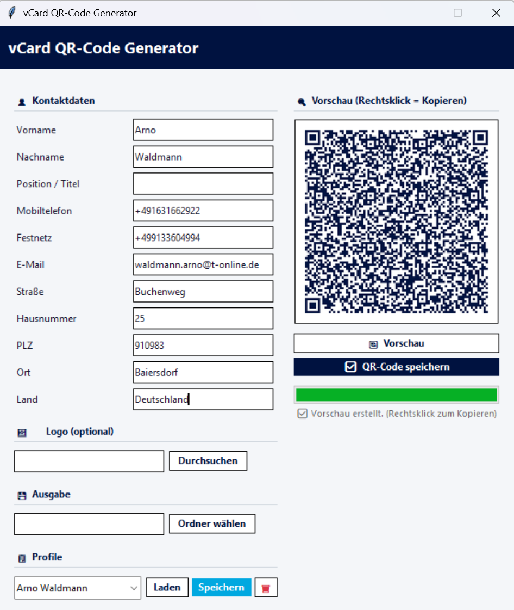

# vCard QR-Code Generator

Ein professionelles Desktop-Tool zur Erstellung von vCard-QR-Codes für digitale Visitenkarten – mit Profilverwaltung, Logo-Integration und direkter Zwischenablage-Unterstützung.


---

## Features

- **vCard 3.0 konform** – QR-Codes werden von allen modernen Smartphones erkannt
- **Vollständige Kontaktdaten** – Name, Position, Telefon (Mobil & Festnetz), E-Mail, vollständige Adresse
- **Logo-Integration** – Firmenlogo wird mittig in den QR-Code eingebettet
- **Profilverwaltung** – mehrere Kontakte speichern, laden und verwalten (JSON-basiert)
- **Vorschau** – Live-Vorschau direkt in der Anwendung
- **Zwischenablage** – QR-Code per Rechtsklick in die Windows-Zwischenablage kopieren
- **Export** – Speichern als PNG-Datei in einem frei wählbaren Ordner

---

## Screenshots



---

## Voraussetzungen

- Python **3.8** oder neuer
- Windows (für Zwischenablage-Funktion; andere Betriebssysteme werden für QR-Erstellung unterstützt)

---

## Installation

### 1. Repository klonen

```bash
git clone https://github.com/Flying-Bolt/vCARD-Generator.git
cd vCARD-Generator
```

### 2. Abhängigkeiten installieren

```bash
pip install qrcode[pil] Pillow
```

### 3. Anwendung starten

```bash
python "QCode-Atos V1.py"
```

---

## Verwendung

### Kontaktdaten eingeben

Füllen Sie die Felder im linken Bereich aus:

| Feld | Beschreibung | Pflichtfeld |
|------|-------------|-------------|
| Vorname | Vorname des Kontakts | ✅ |
| Nachname | Nachname des Kontakts | ✅ |
| Position / Titel | Berufsbezeichnung | ❌ |
| Mobiltelefon | Mobilnummer (internat. Format, z. B. `+49 163 ...`) | ✅ |
| Festnetz | Festnetznummer | ❌ |
| E-Mail | Geschäftliche E-Mail-Adresse | ✅ |
| Straße | Straßenname | ❌ |
| Hausnummer | Hausnummer | ❌ |
| PLZ | Postleitzahl | ❌ |
| Ort | Stadt / Ort | ❌ |
| Land | Land | ❌ |

### Logo einbinden (optional)

1. Klicken Sie auf **Durchsuchen** im Abschnitt „Logo"
2. Wählen Sie eine Bilddatei (PNG, JPG, BMP, GIF)
3. Das Logo wird automatisch mittig und skaliert in den QR-Code eingebettet

> **Empfehlung:** Verwenden Sie ein quadratisches PNG mit transparentem Hintergrund für beste Ergebnisse.

### QR-Code generieren

- **Vorschau** (`🔄 Vorschau`) – erzeugt eine Vorschau ohne zu speichern
- **Speichern** (`✅ QR-Code speichern`) – generiert und speichert die PNG-Datei

Der Dateiname wird automatisch aus Vor- und Nachname gebildet:
`QR_Vorname_Nachname.png`

### Zwischenablage (Windows)

Nach der Vorschau-Erstellung:
- **Rechtsklick** auf die Vorschau → „📋 Bild kopieren"
- Das Bild kann direkt in E-Mails, Word, PowerPoint etc. eingefügt werden

### Profilverwaltung

Profile ermöglichen das schnelle Wechseln zwischen verschiedenen Kontakten:

| Aktion | Beschreibung |
|--------|-------------|
| **Speichern** | Aktuelle Eingaben als Profil sichern (Name = Schlüssel) |
| **Laden** | Gespeichertes Profil aus Dropdown auswählen und laden |
| **🗑 Löschen** | Ausgewähltes Profil entfernen |

Profile werden lokal in `QR-Code.json` im Programmverzeichnis gespeichert.

---

## Projektstruktur

```
vCARD-Generator/
├── QCode-Atos V1.py   # Hauptanwendung
├── ATOS.png           # Beispiel-Logo
├── .gitignore         # Git-Ausschlüsse
└── README.md          # Diese Datei
```

---

## Technische Details

### vCard-Format (RFC 2426)

Der Generator erstellt vCard 3.0-kompatible Daten mit korrekten CRLF-Zeilenenden:

```
BEGIN:VCARD
VERSION:3.0
N:Nachname;Vorname;;;
FN:Vorname Nachname
ORG:
TITLE:Position
TEL;TYPE=CELL:+49 163 ...
TEL;TYPE=WORK,VOICE:+49 89 ...
ADR;TYPE=WORK:;;Straße Nr;Ort;;PLZ;Land
EMAIL;TYPE=WORK,INTERNET:name@example.com
END:VCARD
```

### QR-Code Parameter

| Parameter | Wert | Beschreibung |
|-----------|------|-------------|
| Version | auto (`fit=True`) | Passt sich automatisch der Datenmenge an |
| Error Correction | `H` (30 %) | Höchste Fehlerkorrektur – ermöglicht Logo-Einbettung |
| Box Size | 10 px | Größe je QR-Modul |
| Border | 3 Module | Ruhezone um den Code |

### Abhängigkeiten

| Paket | Zweck |
|-------|-------|
| `qrcode[pil]` | QR-Code-Erzeugung |
| `Pillow` | Bildverarbeitung & Logo-Einbettung |
| `tkinter` | GUI (in Python-Standardbibliothek enthalten) |

---

## Lizenz

Dieses Projekt steht unter der [MIT-Lizenz](LICENSE).

---

## Mitwirken

Pull Requests sind willkommen. Bitte öffnen Sie bei größeren Änderungen zuerst ein Issue.
